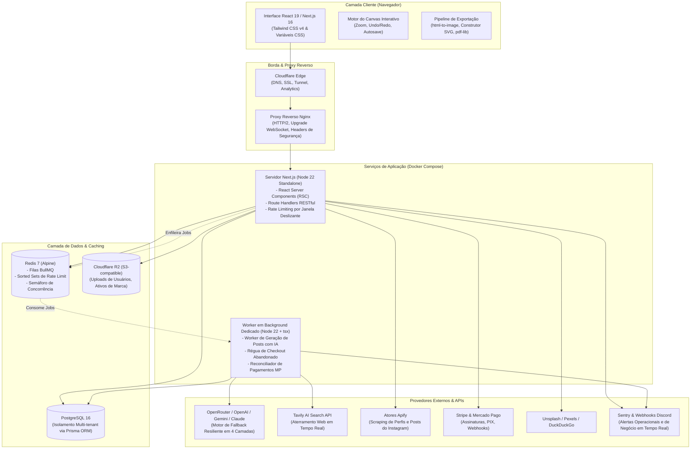

# zapost — Vitrine de Arquitetura & Engenharia de Software

> **Plataforma SaaS Multi-Tenant de Alta Performance para Criação de Conteúdo Visual, Geração Assistida por IA, Filas Distribuídas Assíncronas e Exportação Vetorial Multi-Formato.**

[](https://nextjs.org/)
[](https://react.dev/)
[](https://www.typescriptlang.org/)
[](https://tailwindcss.com/)
[](https://www.postgresql.org/)
[](https://www.prisma.io/)
[](https://redis.io/)
[](https://bullmq.io/)
[](https://www.docker.com/)
[](#)

---

## 📌 Visão Geral

O **zapost** é uma aplicação SaaS full-stack multi-tenant desenvolvida para criação de publicações visuais de alta precisão para redes sociais (feeds, carrosséis 3:4 e stories 9:16).

A plataforma combina um **editor visual interativo em HTML5 Canvas**, um **pipeline de exportação multi-formato** (raster em PNG/JPEG/WebP, vetorial em camadas SVG e compilação de PDFs vetoriais com `pdf-lib`), e um **motor de IA generativa** com **fallback de 4 camadas** e **pesquisa web em tempo real** para aterramento de fatos.

Cargas de trabalho computacionalmente pesadas (geração em lote de posts, réguas de recuperação de checkouts abandonados e reconciliação de pagamentos) são desacopladas do ciclo HTTP e processadas por **workers distribuídos em background** utilizando **BullMQ e Redis**.

> 🔒 *Nota: Este repositório é uma vitrine técnica e arquitetural de portfólio. As regras de negócio proprietárias, prompts sensíveis e credenciais foram desacoplados ou sanitizados. A documentação técnica, os padrões distribuídos, os modelos de segurança e os trechos de código abaixo refletem fielmente a arquitetura em produção.*

---

## 🏛️ Arquitetura do Sistema



---

## ⚡ Destaques de Engenharia & Decisões Técnicas

### 1. Arquitetura Multi-Tenant com Isolamento Absoluto
* **Vazamento Zero entre Tenants:** Todas as consultas ao banco de dados são escopadas estritamente pelo `tenantId` do usuário autenticado (`prisma.post.findFirst({ where: { id, tenantId } })`).
* **Pipeline Rígido de Mutação em 4 Etapas:** Todas as rotas de API mutadoras (`POST`, `PATCH`, `DELETE`) executam um fluxo obrigatório:
  $$\text{Validação CSRF (Same-Origin)} \longrightarrow \text{Autenticação de Sessão} \longrightarrow \text{Validação Zod} \longrightarrow \text{Mutação Escopada por Tenant}$$
* **Ciclos de Vida em Cascata:** A exclusão de tenants remove em cascata assinaturas, perfis de marca, posts, logs de mídia e registros de auditoria.

### 2. Filas Distribuídas & Workers Assíncronos (BullMQ + Redis)
* **Desacoplamento do Ciclo HTTP:** A geração de posts por IA opera de forma assíncrona. O cliente faz a requisição (`POST /api/posts/generate`), recebe imediatamente status `202 Accepted` com um `jobId`, e acompanha o progresso via polling não-bloqueante (`usePostGeneration`).
* **Retentativas Resilientes:** Retentativas automáticas com backoff exponencial (atraso inicial de 30s, máximo de 2 retentativas) e políticas customizadas de retenção (`removeOnComplete: 24h`, `removeOnFail: 48h`).
* **Container Dedicado de Worker:** Os processos em background rodam em um container isolado com runtime `tsx`, executando TypeScript diretamente sem necessidade de etapas extras de compilação.

### 3. Rate Limiting Distribuído & Controle de Concorrência
* **Rate Limiter por Janela Deslizante (Sliding Window):** Protege endpoints sensíveis (autenticação, geração de IA, checkout) em deploys com múltiplas instâncias usando Redis Sorted Sets (`ZREMRANGEBYSCORE`, `ZCARD`, `ZADD`, `PEXPIRE`) em pipelines atômicos.
* **Semáforo Distribuído de Concorrência:** Operações de alto custo (como regeração de legendas em tempo real) adquirem leases atômicos no Redis via `INCR`/`DECR` com TTL de proteção para evitar saturação de cotas dos modelos de IA.

### 4. Motor de IA Resiliente em 4 Camadas com Aterramento Web
* **Mecanismo de Fallback em Cascata:**
  * **Camadas 1 e 2:** `openai/gpt-4o-mini` (linha de base rápida com retry automático em caso de falhas transitórias).
  * **Camada 3:** `google/gemini-2.0-flash-lite-001` (fallback de alta velocidade).
  * **Camada 4:** `anthropic/claude-3.5-haiku` (fail-safe final robusto).
* **Saídas Estruturadas Determinísticas:** Imposição de schemas estritos com Zod garante respostas em JSON válidas e tipadas em qualquer modelo.
* **Aterramento Web em Tempo Real:** Integrado à **Tavily AI Search API** via heurística (`shouldUseWebSearch`) para buscar notícias de última hora, lançamentos e fatos recentes antes de alimentar o prompt da IA.

### 5. Motor Gráfico no Navegador & Exportação Vetorial
* **Zero Bloat de Bibliotecas de UI:** Construído com **Tailwind CSS v4** puro e variáveis CSS nativas (paleta neutra escura `#1f1f1e` inspirada no Claude.ai) com custo zero de runtime de estilos.
* **Estado de Canvas Complexo:** Hooks desacoplados gerenciam zoom dinâmico (40% a 240%), histórico de 30 estados de Undo/Redo e autosave inteligente com debounce de 2 segundos.
* **Exportação Multi-Formato:**
  * **Raster:** Exportação de PNG em alta resolução (1x/2x), JPEG (2x) e WebP via `html-to-image`.
  * **SVG Vetorial em Camadas:** Construtor vetorial próprio que preserva camadas separadas, alinhamentos, opacidades e overlays.
  * **PDF Vetorial Multi-Página:** Geração cliente assíncrona com `pdf-lib` e `@pdf-lib/fontkit`, incorporando fontes TrueType/OpenType customizadas em tempo de execução.
  * **Download em Lote:** Empacotamento em memória via `jszip` para download de carrosséis completos em arquivos ZIP.

### 6. Duplo Gateway de Pagamentos & Engenharia de Growth
* **Assinaturas Recorrentes com Stripe:** Ciclo de vida completo (Checkout Sessions, Customer Portal de autoatendimento, upgrades/reativações e webhooks).
* **Mercado Pago (PIX & Cartão):** Processamento de pagamentos locais com worker cron automatizado reconciliando transações aprovadas a cada 10 minutos.
* **Rastreamento Server-Side:** Rastreamento de conversões com **Meta Conversions API (CAPI)** e **TikTok Conversions API (CAPI)** com hashing SHA-256 de dados de clientes.
* **Atribuição & Recuperação de Leads:** Rastreamento completo de parâmetros UTM (`utm_source`, `utm_medium`, `utm_campaign`, `utm_content`), encurtador de URLs proprietário e régua assíncrona de recuperação de checkout abandonado via **Resend**.

### 7. Arquitetura de Segurança Defensiva
* **Content Security Policy (CSP Estrito):** Configurado em `next.config.ts`, restringindo scripts, iframes e conexões externas, compatível com Google Identity Services (GIS) / FedCM.
* **Image Proxy com Defesa contra SSRF:** O endpoint `/api/image-proxy` valida e resolve URLs remotas contra faixas de IP privado (RFC 1918), loopbacks, link-local e serviços de metadados de nuvem (`169.254.169.254`) com DNS Pinning.
* **Padrões Criptográficos:** Hashing de senhas com `bcryptjs` (12 rounds) e tokens de recuperação de senha de uso único criptografados com SHA-256 e expiração curta.

---

## 📂 Estrutura do Repositório

```
zapost/
├── src/
│   ├── app/                      # Next.js 16 App Router (Páginas & Route Handlers RESTful)
│   │   ├── (auth)/               # Autenticação Local, Google One Tap & Recuperação de Senha
│   │   ├── admin/                # Backoffice Superadmin & Dashboards de Métricas
│   │   ├── api/                  # 65+ endpoints REST seguros
│   │   └── editor/               # Interface de edição visual do canvas
│   ├── features/                 # Módulos orientados a domínio
│   │   ├── instagram-editor/     # Motor do canvas, barras de ferramentas, seletores de cor/fonte
│   │   └── onboarding/           # Importação de perfil do Instagram e configuração de marca
│   ├── lib/                      # Domínios arquiteturais centrais
│   │   ├── ai/                   # Gateway multi-modelo de LLMs, prompts e busca Tavily
│   │   ├── auth/                 # NextAuth v5, cabeçalhos de segurança e hash de senhas
│   │   ├── canvas/               # Cálculos do canvas, constantes de layout e exportações
│   │   ├── db/                   # Singleton do Prisma Client e construtor de conexões
│   │   ├── http/                 # Validação SSRF e DNS Pinning
│   │   ├── mercadopago/          # Cliente Mercado Pago e ativação de pagamentos
│   │   ├── meta/ & tiktok/       # Rastreamento server-side via Conversions API (CAPI)
│   │   ├── observability/        # Sentry e despachante estruturado de alertas para o Discord
│   │   ├── queue/                # Conexão BullMQ e definições de filas
│   │   └── storage/              # Cliente Cloudflare R2 / AWS S3
│   └── workers/                  # Processos assíncronos em background
│       ├── index.ts              # Orquestrador de workers
│       ├── post-generation.ts    # Worker de geração de posts com IA
│       ├── abandoned-checkout.ts # Régua de e-mails de recuperação de carrinho
│       └── mp-reconciler.ts      # Cron de reconciliação de pagamentos
├── prisma/
│   └── schema.prisma             # Esquema PostgreSQL (20+ modelos, relações e enums)
├── nginx/
│   └── zapost.conf            # Configuração Nginx com HTTP/2 e SSL
├── Dockerfile                    # Build multi-stage enxuto (Node 22 Alpine)
├── docker-compose.yml            # Stack multi-serviço (App, Worker, Postgres, Redis, Tunnel)
└── docs/                         # Documentações técnicas arquiteturais aprofundadas
```

---

## 🛠️ Matriz de Tecnologias

| Categoria | Tecnologias Utilizadas |
|---|---|
| **Framework Core** | Next.js 16 (App Router, Standalone), React 19, TypeScript 5 |
| **Estilos & Interface** | Tailwind CSS v4, PostCSS, Variáveis CSS Nativas (Sem bibliotecas de UI infladas) |
| **Banco de Dados & ORM** | PostgreSQL 16, Prisma ORM 6 |
| **Cache & Filas Distribuídas** | Redis 7 (Alpine), BullMQ 5, ioredis |
| **Gráficos & Exportação** | HTML5 Canvas, `html-to-image`, `pdf-lib`, `@pdf-lib/fontkit`, `jszip` |
| **IA & Motores de Busca** | OpenRouter, OpenAI (GPT-4o-mini), Gemini 2.0 Flash Lite, Claude 3.5 Haiku, Tavily API |
| **Pagamentos & Monetização** | Stripe SDK, Mercado Pago SDK, Meta CAPI, TikTok CAPI |
| **Armazenamento & CDN** | Cloudflare R2, AWS SDK v3 S3 Client (`@aws-sdk/client-s3`) |
| **Autenticação & Segurança** | NextAuth.js v5, Google Identity Services (One Tap/FedCM), bcryptjs, Zod 4 |
| **Observabilidade & Alertas** | Sentry (`@sentry/nextjs`), Webhooks Discord, Resend |
| **DevOps & Infraestrutura** | Docker, Docker Compose, Nginx, Cloudflare Tunnel, Certbot, GitHub Actions |

---

## 📖 Documentação Arquitetural Aprofundada

Examine o detalhamento técnico de cada subsistema:
* [01. Arquitetura do Sistema & Multi-Tenancy](./docs/01-arquitetura-do-sistema.md)
* [02. Filas Distribuídas, Workers & Rate Limiting](./docs/02-filas-distribuidas-e-resiliencia.md)
* [03. Resiliência de IA em 4 Camadas & Aterramento Web](./docs/03-orquestracao-de-ia-e-fallback.md)
* [04. Motor Gráfico no Navegador & Exportação Vetorial](./docs/04-motor-de-canvas-e-exportacao-vetorial.md)
* [05. Segurança Defensiva, SSRF & Autenticação](./docs/05-seguranca-defensiva-e-conformidade.md)

---

## 💻 Amostras de Código Selecionadas

Examine as implementações sanitizadas em nível de produção:
* [Rate Limiter por Janela Deslizante (Redis Sorted Sets)](./code-samples/rate-limiter.ts)
* [Semáforo Distribuído de Concorrência](./code-samples/concurrency-semaphore.ts)
* [Defesa contra SSRF & Proxy com DNS Pinning](./code-samples/ssrf-defense.ts)
* [Padrão do Motor de Fallback Multi-Modelo de IA](./code-samples/ai-fallback-orchestrator.ts)
* [Dockerfile Multi-Stage & Stack Docker Compose](./code-samples/docker-compose.yml)

---

## 👨‍💻 Autor

**Engenheiro de Software Full-Stack Sênior & Arquiteto de Soluções**
* Contato e Perfil: [GitHub](https://github.com/matheuszalax) | [LinkedIn](https://www.linkedin.com/in/matheus-almeida-gomes-0b6012150/)
* Demonstrações e apresentações técnicas disponíveis mediante solicitação.
